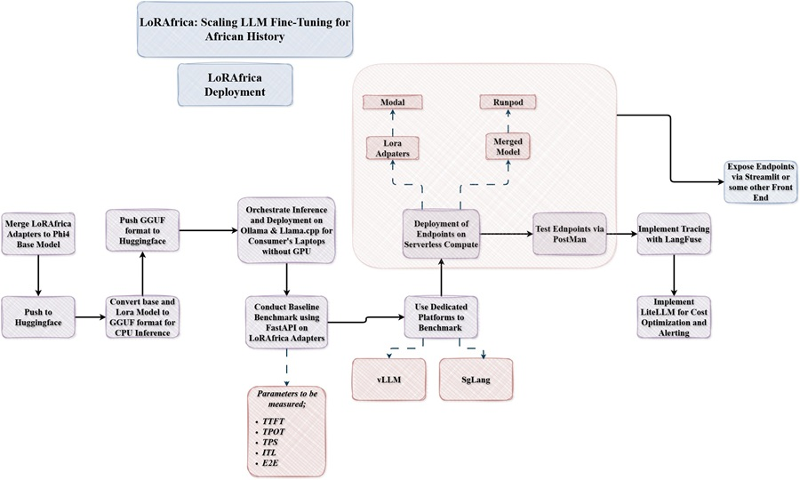

# **LoRAfrica_GGUF: LLMs on Consumer's CPU Systems**


This is the first phase of LoRAfrica Deployment; Making it readily available for consumer's CPU

## **Aim**
Run LLMs on laptops with only cpu

## **Objectives**
- Use Llama.cpp for cpu deployment
- Use Ollama for cpu deployment

## **How the Project Goes**
- Navigate to your desktop and create a new folder called `llm_cpu` 
- Install Git and clone the repo using 
```bash
git clone https://github.com/daniau23/LoRAfrica_GGUF.git
```
or just download the repo and unzip it
- Download and install &nbsp;[Anaconda](https://www.anaconda.com/products/distribution#Downloads)
    - Once Conda is installed, open your CMD and run the following command `C:/Users/your_system_name/anaconda3/Scripts/activate`
    - Should see something like `'(anaconda3)'C:\Users\your_system_name\Desktop\>` as an output in your CMD
        > NB: Do not close the CMD terminal, would be needed later on 
- On your cmd navigate into the `llm_cpu` folder using `cd llm_cpu`
- Run `conda env create -f environment.yml -p ../llm_cpu/lorafrica_cpu` on your cmd 
- Run `conda env list` on your cmd to list all environments created using Anaconda
- Run `conda activate C:\Users\your_system_name\Desktop\llm_cpu\lorafrica_cpu` on your cmd to activate the environment
    - Should see something like `'(lorafrica_cpu)'C:\Users\your_system_name\Desktop\llm_cpu>` as an output in your CMD
- Run `conda list`  on your cmd to check if all dependencies have been installed

- Create your account on [Huggingface](https://huggingface.co/)
- Create your access token on Huggingface
- Log into Huggingface (it will ask for your access token)
```bash
huggingface-cli login
```
You can download the gguf model directly and follow the instructions from [Huggingface Model Card](https://huggingface.co/DannyAI/LoRAfrica_GGUF) to interact with the model 
after running 

```hf download DannyAI/LoRAfrica_GGUF  --local-dir ./gguf_model```

If you want to build and quantise from the lora adapters and base model do the following;
- Via cmd navigate to llama.cpp folder
    - Run the following commands
    ```bash
    # To download base model
    hf download microsoft/Phi-4-mini-instruct  --local-dir ./base_model 

    # To download lora model
    hf download DannyAI/phi4_african_history_lora_ds2_axolotl --local-dir ./lora_model

    # To Convert base_model to gguf
    python convert_hf_to_gguf.py ^
        --outfile ./phi4_mini_instruct_base_model_f16.gguf ^
        --outtype f16 ^
        ./base_model

    # To convert lora_model to gguf
    python convert_lora_to_gguf.py ^
    --base ./base_model ^
    --outfile ./lorafrica_lora_adapter.gguf ^
    ./lora_model

    # To Quantise base_model
    .\build\bin\Release\llama-quantize.exe .\phi4_mini_instruct_base_model_f16.gguf .\phi4_mini_instruct_q4_k_m.gguf Q4_K_M
    ```
copy the  quantised base model and lora gguf files into a another separate folder (eg. *gguf_models*). This is just for the llama.cpp and ollama python sdk as shown in the jupyter notebooks

- Within the gguf_models, to upload the models to Huggingface run the following;

```bash
huggingface-cli repo create repo_name
```

```bash
huggingface-cli upload huggingface_username/repo_name ./gguf_models .
```

- Run this to start your local server
```bash
.\build\bin\Release\llama-server -m phi4_mini_instruct_q4_k_m.gguf ^
 --lora lorafrica_lora_adapter.gguf --host 0.0.0.0 --port 8080
```
- Paste this url into your browser to interact with the model
on [llama.cpp localhost](http://localhost:8080/v1/chat/completions) on your system

For more details refer to [Huggingface Model Card](https://huggingface.co/DannyAI/LoRAfrica_GGUF)

### **Ollama Users**
For Ollama users to interact with the model
- Download and install the Ollama app
- In cmd run 
```bash
ollama create LoRAfrica -f Modelfile
```
This creates the model for local use.

**The model is live on Ollama**
- So for a more straightforward approach;
    - Ensure the Ollama app is downloaded on your system
    - Then run 
        ```bash
        ollama run daniau23/lorafrica_gguf
        ```
        - Then Model is ready for use locally on your system

[Ollama Model File Link](https://ollama.com/daniau23/lorafrica_gguf)
- Open Ollama, select the Model and HAVE FUN!!! 😊

## **Advice**
If you have limited CPU, use the llama.cpp route as you use a localhost server and save your system the overhead. But if you have loads of RAM, Ollama is your best friend but you can't make configurations like with llama.cpp.

Enjoy Everyone!!😊😊😊